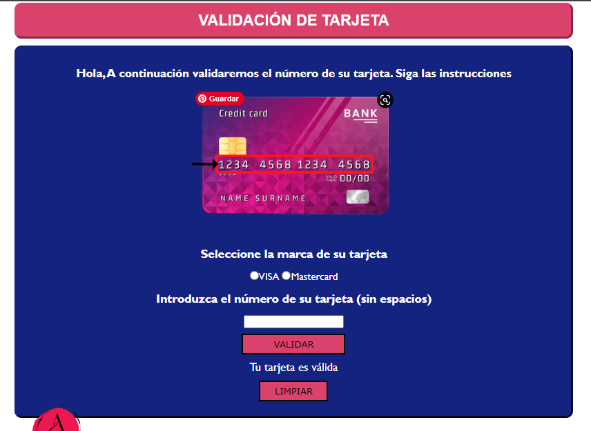
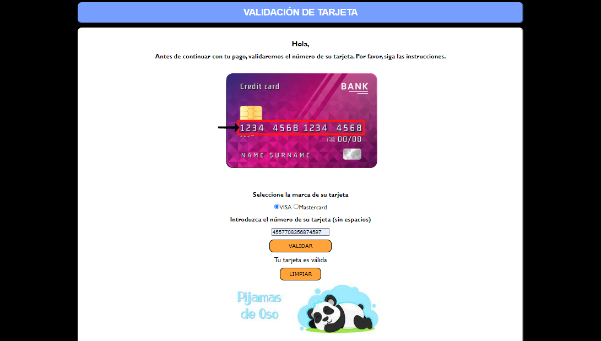

# **PROYECTO VALIDACIÓN TARJETA**
 * Este Web App validará el número de la tarjeta, antes de realizar un pago por línea, de una tienda de ropa.

## UX
  * Los usuarios finales serían los clientes de la marca de ropa.
  * El objetivo es validar el número de la tarjeta antes de realizar la compra, a fin de favorecer tanto a los clientes o usuaros finales como al dueño del emprendimiento, para evitar el rechazo de la tarjeta o posibles fraudes.
  

## UI
  * El feedback recibido por mis compañeras de este primer bosquejo fue; se ve amigable y fácil de usar, entendible y como opción podría agregar un mensaje que la página es confiable. 
  * Puse 4 inputs para ingresar los números en grupos de 4 (tarjetas de 16 dígitos)
  * Procure ordenar y utilizar algunos colores para diferenciar los botones de los imputs donde tienen que llenar los números. No agregue el mensaje que la página es confiable ya que no se me ocurre donde puede ir.
  * En el prototipo final solo puse dos marcas de tarjetas ya que son las más utilizadas a nivel nacional(Perú).

## DESARROLLO

* Los primeros pasos que hice fue maquetar el prototipo en HTML. Búsque la información necesaria para tener los inputs necesarios y texto. Agregue algunas etiquetas que conocí en el proceso de investigación.
* En la realización del CSS no me tome mucho tiempo y solo aplique algunas propiedas generales. 
* Estuve cambiando algunas cosas como la ubicación del botón limpiar y los colores destinados.

* Al comenzar JS, me tome más tiempo para entender algunos términos y también para comprender la lógica de la programación. 
  * identifcación del problema a resolver en JS: Automatizar una validación de tarjeta de crédito con el código Luhn (fórmula de suma de verificación)
  * Hice el cambio del imput donde ingresarían el número de tarjeta, ya que se me haría complicado trabajar con 4 diferentes imputs.
  * Antes de finalizar decidí cambiar el diseño de la interfaz, cambiando los colores para que se pueda ver mejor.s
   

  

