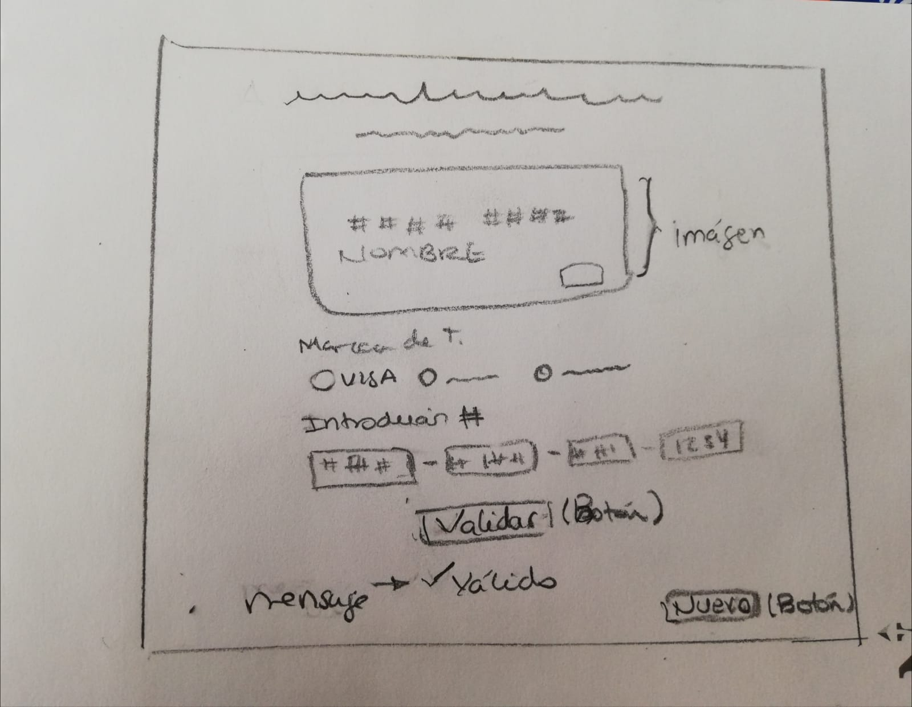

# **PROYECTO VALIDACIÓN TARJETA**
 * Este Web App validará el número de las tarjetas antes de realizar un pago por línea, de una tienda de ropa.

## UX
  * Los usuarios finales serían los clientes de la marca de ropa.
  * El objetivo es validar el número de la tarjeta antes de realizar la compra, a fin de favorecer tanto a los clientes o usuaros finales como al dueño del emprendimiento, para evitar el rechazo de la tarjeta o posibles fraudes.
  

  * El feedback recibido por mis compañeras de este primer bosquejo fue que, se ve amigable y fácil de usar, entendible y como opción podría agregar un mensaje que la página es confiable. 
  * Procure ordenar y utilizar algunos colores para diferenciar los botones de los imputs donde tienen que llenar los números. No agregue el mensaje que la página es confiable ya que no se me ocurre donde puede ir.
  * En el prototipo final solo puse dos marcas de tarjetas ya que son las más utilizadas a nivel nacional.

## DÍA 1
* HTML, realización de la maquetación
* búsqueda de información sobre HTML
* Pedi Office hours, ya que no me sentía segura con los primeros pasos que seguia en HTML, recibi el feedback donde me señalaron que había algunos atributos mal usados en mi código y tenía confunción con algunos conceptos.
## DÍA 2
* Me encuentro bloqueada y sin entender los concetos de los atributos de los contenedores
## DÍA 3
* Búsqueda de infomación y clarificación de conceptos HTML y CSS.
* Logre realizar la maquetación HTML con su funcionalidad, comence a darle estilo a la página.
## DÍA 4
* Aplicación del CSS y finalización.
* Estuve iterando y completando algunas etiquetas que puse en HTML y CSS, a medida que investigaba y veía más etiquetas y funciones las gregue a lo que realice en un principio. (de 4 casillas para los # lo cambie a solo una, cambie los colores y en algunas etiquetas de html agregue o cambie un id por class para un mejor uso en Css)
## DÍA 5
* Investigación sobre JS y el código Luhn.
* identifcación del problema a resolver en JS: Automatizar una validación de tarjeta de crédito con el código Luhn (fórmula de suma de verificación)
  * Investigación de RegEx e implementación en código.
    

  

